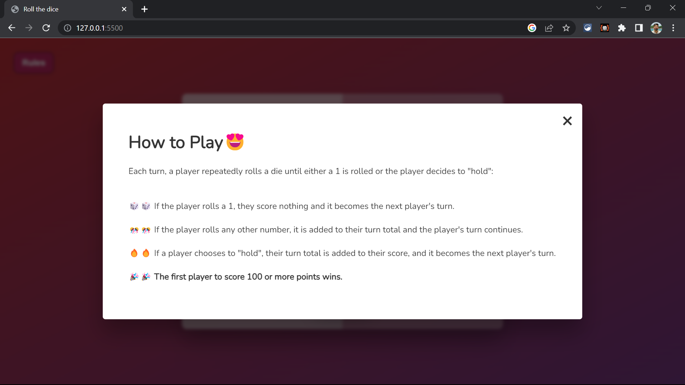

# Pig Game

This is a fun dice game called "Pig Game" implemented using vanilla JavaScript, HTML, and CSS.

## Tech Stack
The project is built using the following technologies:

- Vanilla JavaScript: The game logic and interactivity are implemented using plain JavaScript.
- HTML: The structure and layout of the game interface are created using HTML.
- CSS: The styling and visual presentation of the game are handled with vanilla CSS.

## Control Flow Diagram

Here is a diagram representing the control flow of the game's programming:

## How to Play

- Each turn, a player repeatedly rolls a die until either a 1 is rolled or the player decides to "hold".
- If the player rolls a 1, they score nothing and it becomes the next player's turn.
- If the player rolls any other number, it is added to their turn total, and the player's turn continues.
- If a player chooses to "hold", their turn total is added to their score, and it becomes the next player's turn.
- The first player to score 100 or more points wins!

## Project Demo

You can play the game online by visiting the following link: <b> [Pig Game (Deployed Link)](https://dicegame-mohit.netlify.app/)</b>

## Screenshots

### Desktop Version

### Mobile Version

> Feel free to explore the source code to understand the game implementation and have fun playing Pig Game!
